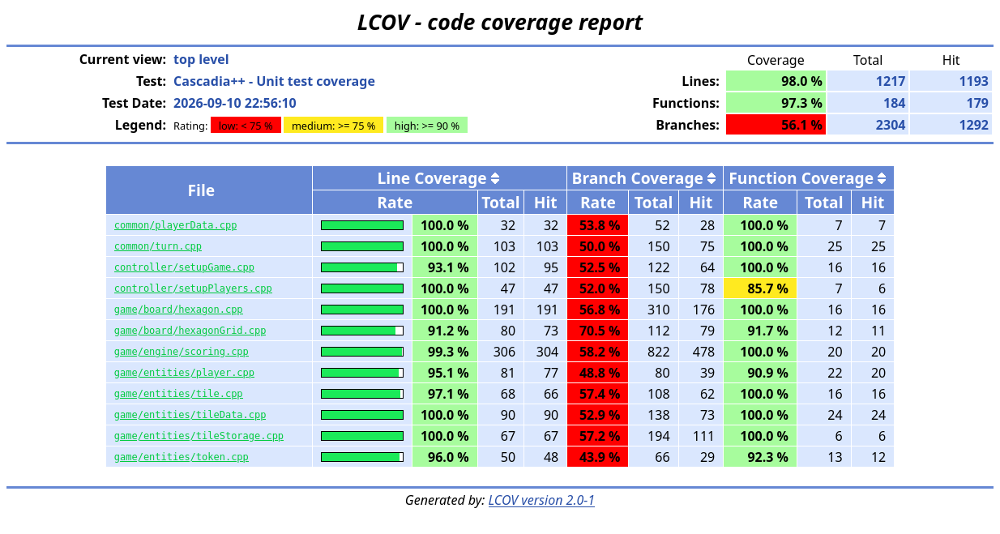

# Izveštaj analize Cascadia++

**Autor**: Julijana Jevtić, indeks 1131/2025

**Projekat**: [Cascadia++](https://gitlab.com/matf-bg-ac-rs/course-rs/projects-2024-2025/cascadia/-/tree/main?ref_type=heads)

**Grana**: `main`

**Commit korišćen u `cascadia++/`**: `c32895403185b6ae4a968d4517d8a634adfe80ee`

## 1. Izbor projekta i obrazloženje izbora alata

Cascadia++ je pogodan projekat za analizu verifikacije zato što je njegova osnovna logika konkretna i deterministička, ali ipak uključuje dovoljno promena stanja i kombinatornog ponašanja da simboličko istraživanje i fuzzing budu smisleni. Projekat nije trivijalan primer sa jednom glavnom funkcijom; on ima model table, logiku poteza, stanje igrača i pravila na nivou mreže koja se mogu izvršavati više puta sa različitim ulazima.

Ovaj projekat je dobar izbor i zato što je napisan u jeziku C++ (moja preferenca).
Pre izbora proverila sam da se zaista izgrađuje i pokreće: konfigurisala sam ga pomoću CMake-a, projekat se uspešno kompajlirao, a probno pokretanje pokazalo je da se aplikacija pokreće bez grešaka tokom izvršavanja.

Iz perspektive verifikacije, to ga čini dobrim kandidatom za:

- jedinične testove koji proveravaju očekivano ponašanje izdvojenih logičkih objekata;
- simboličko izvršavanje koje istražuje klase stanja i ograničenja;
- proveru modela koja proverava promene stanja u odnosu na tvrdnje;
- profilisanje koje prepoznaje računski zahtevna mesta u petlji igre i ažuriranju table;
- fuzzing koji opterećuje parsiranje, rukovanje podacima i ponašanje u graničnim slučajevima;
- statičku analizu koja otkriva sumnjive obrasce pre izvršavanja.

Glavna ideja nije samo pronalaženje jedne greške, već pokazivanje kako nekoliko komplementarnih tehnika može zajedno da se primeni na istom projektu.

## 2. Okruženje

- Operativni sistem: Ubuntu 26.04, 64-bitno Linux okruženje
- Sistem za izgradnju: CMake 4.2.3
- Kompajler: GNU g++ 15.2.0; C++17 za testove i C++20 za izgradnju igre korišćenu uz Memcheck
- Biblioteka i testni okvir: Qt 6.10.2 i Qt Test
- Alati za analizu i merenje: Valgrind 3.26.0, gcov i LCOV 2.0-1
- Pokretanje testova: CTest
- Okruženje za izvršavanje skripti: Python 3.14.4

## 3. Jedinični testovi

Za proveru izabranih delova aplikacije Cascadia++ pripremljeni su testovi u okviru **Qt Test**, dok su za merenje pokrivenosti korišćeni **GCC/gcov i LCOV**. Izgradnja je organizovana pomoću CMake-a, a izvršive datoteke sa testovima registrovane su u okviru CTest-a.

Cilj testiranja je provera očuvanja podataka, rotacije pločica, učitavanja JSON datoteka, susedstva na tabli, izračunavanja poena i pripreme početnog stanja igre.


### 3.1. Konfiguracija i izvršavanje

Za izgradnju testova potrebni su GCC, CMake i Qt 6, uključujući module `Core`, `Test` i `Widgets`. Praćenje pokrivenosti zahteva odgovarajući `gcov`, kao i alate `lcov` i `genhtml`. Projekat za testiranje zahteva CMake 3.16 ili noviji i C++17.

Podešavanja za praćenje pokrivenosti nalaze se u lokalnoj datoteci `unit_tests/coverage.cfg`, koja se pri prvom podešavanju dobija kopiranjem primera:

```bash
cp unit_tests/coverage.cfg.example unit_tests/coverage.cfg
```

Kopiranje nije potrebno ponavljati ako lokalna konfiguracija već postoji. U njoj se podešavaju GCC izvršiva datoteka (`CXX`), odgovarajući alat `GCOV_TOOL`, broj paralelnih poslova, uključivanje sanitajzera, rano filtriranje izvora i automatsko otvaranje HTML izveštaja. Za ovu konfiguraciju pokrivenosti podržan je GCC.

Iz korena repozitorijuma analiza se pokreće komandom:

```bash
bash unit_tests/coverage.sh
```

Skripta izgrađuje testove u direktorijumu `build_coverage`, resetuje prethodne brojače, pokreće CTest, prikuplja podatke o izvršavanju i generiše HTML izveštaj. U konfiguraciji koriste se opcije `-O0`, `-g` i `--coverage`. Instrumentacija sanitajzerima podešava se nezavisno opcijom `ENABLE_SANITIZERS`.

Testovi grafičkih klasa koriste `QApplication` i platformu `offscreen`, pa se izvršavaju bez prikazivanja prozora. Resursi potrebni za proveru slika uključuju se preko originalne datoteke `resource.qrc`.

Skripta čuva rezultate pojedinačnih pokretanja u direktorijumima `unit_tests/reports/run_*`, a poslednji uspešno generisan HTML izveštaj i odgovarajući log testova čuvaju na putanjama:

- `unit_tests/reports/html/index.html` — početna stranica izveštaja o pokrivenosti;
- `unit_tests/reports/tests.log` — izlaz testova, uključujući neuspešne provere.

Generisanje pokrivenosti nastavljam i kada CTest prijavi neuspešne testove, a izlazni status testiranja se čuva. Ako generisanje izveštaja ne uspe, prethodno objavljen HTML ne treba smatrati rezultatom novog pokretanja.

### 3.2. Organizacija i sadržaj testova

Pripremljeni skup obuhvata **12 proizvodnih klasa i 14 Qt Test izvršivih programa**, registrovanih kao zasebni CTest testovi. Dve dodatne datoteke proširuju provere alternativnim granama u klasama `Hexagon` i `Scoring`. 

| Datoteka sa testovima | Klasa | Glavni predmet provere |
|---|---|---|
| `test_tile_data.cpp` | `TileData` | Stanje pločice na tabli, geteri i seteri, serijalizacija, deserializacija i zamena prethodnih lista |
| `test_player_data.cpp` | `PlayerData` | Identitet i ime igrača, kolekcija centralnih pločica i očuvanje podataka pri serijalizaciji |
| `test_turn.cpp` | `Turn` | Konstruktor poteza, token, indeksi, podaci o pločicama, serijalizacija i provere pokazivača |
| `test_tile.cpp` | `Tile` | Sadržaj pločice, rotacije, prelazak između 0° i 300°, pun krug i očuvanje rotacije pri deserializaciji |
| `test_tile_storage.cpp` | `TileStorage` | Učitavanje pločica i početnih grupa iz JSON-a, redosled, prazne kolekcije i greške pri učitavanju |
| `test_hexagon_grid.cpp` | `HexagonGrid` | Susedi u parnim i neparnim redovima, ivice table, simetrija susedstva i označavanje dostupnih polja |
| `test_hexagon.cpp` | `Hexagon` | Geometrija grafičkog polja, kopiranje podataka, prikaz u sceni i signal klika |
| `test_token.cpp` | `Token` | Indeks i oblik tokena, serijalizovana polja, slike životinja, vlasništvo scene i signal klika |
| `test_player.cpp` | `Player` | Postavljanje početnih pločica, stanje igrača, nezavisnost kopije table i objavljivanje izračunatih poena |
| `test_scoring.cpp` | `Scoring` | Bodovanje životinja i povezanih staništa, uz regresione scenarije za nepravilne grupe |

### 3.3. Metodologija

Za poređenje stvarnih i očekivanih vrednosti koriste se `QCOMPARE` i `QVERIFY`, a za očekivane izuzetke `QVERIFY_EXCEPTION_THROWN`. Provere signala koriste `QSignalSpy`. Testovi sa više ulaza organizovani su pomoću funkcija sa sufiksom `_data`, redova `QTest::newRow` i preuzimanja podataka preko `QFETCH`.

Obuhvaćeni su tipični ulazi i granični slučajevi. Za učitavanje se koriste male privremene datoteke sa unapred poznatim sadržajem, nezavisno od veličine originalne kolekcije.

Kod serijalizacije proveravaju se i pojedinačna zapisana polja i povratno pretvaranje u objekat. Deserializacija se dodatno proverava pomoću ručno sastavljenih mapa, kako očekivani ulaz ne bi uvek zavisio od iste proizvodne funkcije za serijalizaciju.

Sve testne klase koriste isti obrazac: deklaracije testova nalaze se u `private slots`, a definicije ispod klase imaju oblik `TestClass::method()`. Qt Test automatski poziva `init()` pre svake testne funkcije, odnosno svakog reda podataka, i `cleanup()` nakon nje.

### 3.4. Rezultati pokrivenosti



Iz posmatranih klasa ukupno su ostale nepokrivene **24 linije, 5 funkcija i 1012 grana**. Procenti se odnose na odabranih 12 implementacionih datoteka, a ne na celu aplikaciju, sva njihova zaglavlja ili sve zavisnosti.

Visoka pokrivenost linija pokazuje da je izvršen veliki deo izabranih implementacija. Niža pokrivenost grana pokazuje da nisu zabeleženi svi ishodi grananja. Jedna izvršena linija može sadržati složen uslov sa više mogućih ishoda. LCOV/gcov može evidentirati i grane povezane sa obradom izuzetaka koje generiše C++ kompajler; bez pregleda pojedinačnih zapisa ne može se utvrditi njihov udeo među nepokrivenim granama.

### 3.5. Uočeni problemi

Pokrivenost nije mera ispravnosti rezultata. Na primer, `Turn` ima 100% pokrivenosti linija i funkcija, ali test konstruktora ipak otkriva izgubljenu vrednost tokena. 

Uočavamo **pet neuspešnih testnih funkcija u tri Qt Test klase** (`turn_tests`, `tile_tests` i `scoring_tests`). Dve provere u klasi `TestTile` reprodukuju isti propust, pa ovi rezultati predstavljaju **četiri različita problema**.

#### 3.5.1. Konstruktor klase Turn ne čuva prosleđeni token

Test `constructorPreservesPlacedToken()` konstruiše `Turn` sa argumentom `"bear"` i odmah proverava `getPlacedToken()`. Dobijena je prazna niska `""`. Pregled `common/turn.cpp` pokazuje da parametar `placedToken` nije upotrebljen u listi inicijalizacije članova, pa član tipa `QString` ostaje prazan.

**Posledica:** objekat gubi token prosleđen konstruktoru. U istom konstruktoru nedostaju inicijalizacije `playerId` i `newTile`.

**Predlog ispravke:** inicijalizovati `placedToken`, `playerId` i `newTile` prosleđenim argumentima, uz redosled članova iz `turn.h`.

#### 3.5.2. Deserializacija klase Tile ne vraća rotaciju

Prvi test u `test_tile.cpp` serijalizuje pločicu rotiranu za 120° i učitava podatke u novu pločicu. Iako mapa sadrži rotaciju, odredište ostaje na 0°. Drugi test polazi od objekta rotiranog za 240° i učitava nezavisno pripremljenu mapu sa rotacijom 60°; objekat ostaje na 240°.
Vidimo da se pri deserializaciji zadržava prethodna rotacija odredišta.

**Posledica:** rotacija se ne očuva pri povratnom pretvaranju (`fromVariant()`) i ne ažurira pri učitavanju nove vrednosti.

**Predlog ispravke:** u `Tile::fromVariant()` učitati `m_rotation` iz mape i zadržati obe provere kao regresione testove istog propusta.


#### 3.5.3. Savijena grupa losova pogrešno se boduje kao pravolinijska

Test postavlja losove (`elk`) na polja `(2,2)`, `(2,3)` i `(3,3)`. Grupa je povezana, ali nije pravolinijska. Dozvoljena podela je par i jedan pojedinačni token, što daje **5 + 2 = 7** poena. Program vraća **9**.
Pregled `generateAllElkLines()` i `findElkLine()` pokazuje prikupljanje povezanih tokena bez odgovarajuće provere pravolinijskog rasporeda. Dobijena grupa veličine tri zatim se boduje sa devet poena.

**Posledica:** u ovom scenariju rezultat je netačan, uvećan je za dva poena.

**Predlog ispravke:** formirati dozvoljene pravolinijske grupe i izabrati najvredniju podelu bez višestrukog bodovanja istog tokena.

#### 3.5.4. Razgranata grupa lososa pogrešno se boduje kao niz

Test postavlja losose (`salmon`) na `(4,4)`, `(4,3)`, `(3,4)` i `(5,4)`. Središnji token ima tri susedna lososa. Očekuje se **0** poena, a dobijeno je **11**.
Dozvoljen niz ima najviše dva susedna lososa po tokenu i ne sme dodirivati druge losose van niza.

`findSalmonRun()` prikuplja povezanu grupu, ali ne proverava ograničenje broja suseda. `calculateSalmonScore()` zatim veličinu grupe, četiri, pretvara u 11 poena.

**Posledica:** nevažeća grupa dobija 11 poena. 
**Predlog ispravke:** proveriti validnost cele grupe pre dodele poena i odbaciti razgranate grupe.

### 3.6. Ograničenja i evidencija izvršavanja

Analiza ne obuhvata kompletnu mrežnu komunikaciju, sve tokove partije, sve interakcije korisničkog interfejsa niti sve varijante kartica bodovanja. Grafički testovi sa platformom `offscreen` proveravaju određene objekte, signale i prikaz, ali ne zamenjuju proveru celog korisničkog toka. Kod pripreme igre nisu iscrpno ispitane sve nevažeće kombinacije ulaza i svi mogući ishodi slučajnog mešanja.

## 4. Valgrind Memcheck

Za dinamičku analizu upravljanja memorijom korišćen je **Valgrind Memcheck**. Alat proverava memorijske operacije tokom izvršavanja programa: neispravna čitanja i upise, upotrebu neinicijalizovanih vrednosti, neispravno oslobađanje i curenje memorije. Analiza je obuhvatila **12 testnih izvršivih programa** i **dve interaktivne sesije igre**. Time su provereni i izdvojeni objekti i deo toka njihove zajedničke upotrebe u aplikaciji.

### 4.1. Konfiguracija i pokretanje

Korišćen je Valgrind 3.26.0. Izgradnje za Memcheck odvojene su od izgradnje za pokrivenost: testovi se izgrađuju u `build_memcheck`, a igra u `build_memcheck_game`. Koristi se konfiguracija `Debug`, sa opcijama `-O0 -g`, bez instrumentacije sanitajzerima i za pokrivenost. Testovi koriste C++17, a analiziran build igre C++20.

Testni programi koji zahtevaju grafičke komponente izvršavaju se sa `QT_QPA_PLATFORM=offscreen`. Interaktivne sesije koriste grafičko okruženje računara; u njihovim metapodacima izbor Qt platforme je automatski.

Za testove se koristi skripta [run_tests_memcheck.sh](valgrind/memcheck/run_tests_memcheck.sh). Pre prvog pokretanja kopira se primer konfiguracije, a u nizu `TESTS` biraju se izvršivi programi:

```bash
cp valgrind/memcheck/memcheck.cfg.example valgrind/memcheck/memcheck.cfg
bash valgrind/memcheck/run_tests_memcheck.sh
```

Postojeću lokalnu konfiguraciju nije potrebno ponovo kopirati. Igra se pokreće skriptom [run_game_memcheck.sh](valgrind/memcheck/run_game_memcheck.sh), uz naziv scenarija:

```bash
bash valgrind/memcheck/run_game_memcheck.sh startup_exit
bash valgrind/memcheck/run_game_memcheck.sh partial_game
```

Pri ponavljanju analize treba sačuvati prethodne rezultate i izabrati novi naziv sesije, na primer `partial_game_repeat`.

Memcheck se pokreće direktno nad izvršivim programima, sa opcijama `--leak-check=full`, `--show-leak-kinds=all`, `--track-origins=yes` i `--num-callers=30`. Opcije `--errors-for-leak-kinds=definite,possible` i `--error-exitcode=99` omogućavaju da prijavljene memorijske greške, uključujući ove kategorije curenja, utiču na izlazni status.

Za svaki test čuvaju se `memcheck_<test>.log` i `<test>_output.log`, dok `summary.tsv` beleži izlazne kodove. Za svaku sesiju igre čuvaju se `memcheck.log`, `game_output.log` i `session.md`. 

### 4.2. Rezultati nad jediničnim testovima

U svih **12 analiziranih pokretanja** kategorije `definitely lost`, `indirectly lost` i `possibly lost` imaju po **0 bajtova**. U devet pokretanja Memcheck prijavljuje nula grešaka, a u tri po jednu grešku pri inicijalizaciji Qt-a.

| Testni program | Memcheck greške | Izgubljena memorija, bajtovi | `Still reachable`, bajtovi |
| --- | ---: | ---: | ---: |
| `cascadia_unit_tests` | 0 | 0 | 17.400 |
| `player_data_tests` | 0 | 0 | 17.400 |
| `turn_tests` | 0 | 0 | 17.400 |
| `tile_tests` | 0 | 0 | 17.400 |
| `tile_storage_tests` | 0 | 0 | 17.400 |
| `token_tests` | 0 | 0 | 24.547 |
| `scoring_tests` | 1 | 0 | 24.610 |
| `hexagon_branch_tests` | 1 | 0 | 24.914 |
| `hexagon_grid_tests` | 1 | 0 | 24.914 |
| `hexagon_tests` | 0 | 0 | 24.914 |
| `player_tests` | 0 | 0 | 24.914 |
| `scoring_branch_tests` | 0 | 0 | 24.914 |


Tri prijave Memcheck greške imaju isti obrazac `Invalid read of size 16` i putanju inicijalizacije Qt/IBus komponenti. U prikazanom primeru čitanje počinje na pomeraju 27 u bloku od 42 bajta: preostaje 15 bajtova, a pokušava se čitanje 16. To je prijava neispravnog čitanja, odvojena od klasifikacije curenja memorije.

Ovi tragovi ukazuju na mogući zajednički problem tokom inicijalizacije biblioteka. Tačan uzrok nije utvrđen, pa prijave nisu označene kao bezopasne niti kao tri nezavisna defekta igre. Tragovi preostale dostupne memorije uključuju GLib, libgomp, DBus i Fontconfig. Kategorija `still reachable` znači da je memorija i dalje dostupna preko pokazivača; sama po sebi ne dokazuje grešku.


### 4.3. Interaktivne sesije igre

| Sesija | Izvršene aktivnosti | Početak–kraj | Način završetka |
| --- | --- | --- | --- |
| `startup_exit` | Pokretanje aplikacije i prikaz glavnog menija | 22:49:07–22:50:00 | Klik na `Exit` |
| `partial_game` | Pokretanje partije za jednog igrača, unos imena, više postavljanja pločice i tokena sa završetkom poteza, otvaranje dijaloga preko dugmeta `Back` | 23:25:50–23:28:54 | Klik na `Exit` |

Obe sesije imaju izlazni kod **99**. Uz korišćenu opciju `--error-exitcode=99`, ovaj status označava da je Memcheck prijavio greške. Evidencija sesija navodi zatvaranje dugmetom `Exit`; kod 99 sam po sebi ne označava pad aplikacije.

#### 4.3.1. Pokretanje i zatvaranje aplikacije — startup_exit

Izdvojeno je 75 zapisa povezanih sa izvornim fajlovima igre. Zapis 45 prijavljuje **110 bajtova** izgubljene memorije: 56 direktno i 54 indirektno. Alokacije potiču iz `drmGetVersion`, pozvane preko FFmpeg-a i Qt Multimedia tokom stvaranja objekta `Settings`. 

Zapis 57 prijavljuje **720 bajtova `possibly lost`** pri učitavanju biblioteka i upravljanju podacima lokalnim za nit. Preostalih 70 zapisa pripada kategoriji `still reachable`.


#### 4.3.2. Deo partije za jednog igrača — partial_game

Ova sesija obuhvata i stvaranje objekata partije i njihovu upotrebu tokom poteza. U izdvojenim zapisima prijavljeni su sledeći nalazi:

| Nalaz | Zapis | Tumačenje |
| --- | ---: | --- |
| 159.451 bajt izgubljene memorije: 24 direktno i 159.427 indirektno | 1165 | Alokacija u `xkb_compose_state_new`, preko Qt Wayland-a, tokom unosa imena; tačan uzrok gubitka nije utvrđen |
| 110 bajtova izgubljene memorije: 56 direktno i 54 indirektno | 636 | Isti obrazac alokacija u putanji libdrm/FFmpeg/Qt Multimedia kao u sesiji `startup_exit` |
| Tri prijave `Invalid read of size 16` | 1–3 | Tragovi alokacije uključuju Qt i Wayland dodatak `libadwaita`; mesta samih čitanja prikazana su kao `???` |
| 720 bajtova `possibly lost` | 1026 | Učitavanje biblioteka i upravljanje podacima lokalnim za nit; curenje nije potvrđeno |

Prisustvo Cascadia++ funkcije u tragu poziva pokazuje iz kog toka aplikacije se došlo do biblioteke. Ono samo po sebi ne određuje ko je odgovoran za gubitak memorije ili neispravno čitanje. 

### 4.4. Propust u oslobađanju objekata partije

U logu sesije `partial_game` sledeći objekti ostali su alocirani i klasifikovani su kao `still reachable`:

| Objekat | Zapis | Veličina samog objekta | Mesto stvaranja |
| --- | ---: | ---: | --- |
| `Player` | 736 | 152 bajta | `controller.cpp:115` |
| `Game` | 940 | 328 bajtova | `controller.cpp:128` |
| `Board` | 958 | 368 bajtova | `controller.cpp:118` |


Pregled [controller.cpp](cascadia++/cascadia/controller/controller.cpp) pokazuje konkretan propust: u `Controller::startSinglePlayerGame()` deklarisane su **lokalne promenljive `board` i `game`**, odvojene od istoimenih članova klase. U ovom toku članski pokazivači ostaju `nullptr`, dok `Controller::~Controller()` proverava i briše upravo njih. Tako predviđeno oslobađanje ne obuhvata objekte napravljene za partiju.

Objekti nemaju ni Qt roditelja koji bi ih automatski obrisao. Konstruktor `Board` u [board.cpp](cascadia++/cascadia/game/board/board.cpp) prosleđeni prozor čuva kao `parentWidget`, ali ne inicijalizuje bazni `QObject` tim roditeljem. `GameGui` čuva pokazivač na `Game`, ali ga njegov destruktor ne briše.

Igrač napravljen u istoj funkciji nije dodat u člansku kolekciju `Controller::m_playerOrder`, koju destruktor oslobađa. Kopije kolekcija pokazivača u `SetupPlayers` i `Game` ne brišu automatski objekte tipa `Player`.

**Posledica:** u pregledanom toku ne postoji predviđeno oslobađanje ovih objekata partije. Njihovi pokazivači mogu ostati dostupni, pa Memcheck kategorija `still reachable` ne isključuje propust u upravljanju životnim vekom. Zaključak o ovom propustu zasniva se na kombinaciji loga i pregleda koda.

**Predlog ispravke:** jasno odrediti vlasnike objekata `Game`, `Board` i `Player`, sačuvati ih u odgovarajućim članovima kontrolera. Pri tome treba uskladiti redosled uništavanja i izbeći višestruko brisanje.

### 4.5. Ograničenja i evidencija

Osnovu rezultata čine dokument **Memcheck na unit testovima** i popunjene datoteke `session.md` za `startup_exit` i `partial_game`. Uz njih se čuvaju izvorni Memcheck logovi i izlaz testnih programa odnosno igre. Brojevi zapisa u odeljku o igri odnose se na izdvojene izveštaje `cascadia_findings.md`, a ne na redove u izvornom logu.

Skripta za izdvajanje zadržava cele zapise koji pominju prepoznate izvorne fajlove igre. Takav pregled olakšava analizu, ali nije potpuna klasifikacija odgovornosti. Navedene veličine iz pojedinačnih zapisa nisu ukupna `LEAK SUMMARY` za ceo proces, a broj izdvojenih zapisa nije broj potvrđenih defekata. Zapisi sa bibliotečkim alokacijama čuvaju se i kada njihov uzrok nije razjašnjen.

Memcheck posmatra samo izvršene putanje. Ove dve sesije ne obuhvataju završetak cele partije, više uzastopnih partija, sve korisničke akcije niti mrežnu igru. Rezultati jediničnih testova zato ne zamenjuju proveru celog toka stvaranja, upotrebe i oslobađanja objekata u aplikaciji.

## Zaključak

Dosadašnja analiza pokazuje da jedinični testovi, merenje pokrivenosti i Memcheck daju različite informacije o kvalitetu aplikacije. Jedinični testovi su izdvojili četiri funkcionalna problema: gubitak podatka u konstruktoru poteza, neobnavljanje rotacije pri deserializaciji i dva nepravilna obračuna poena. Visoka pokrivenost izvršenih linija ne poništava ove neuspešne provere niti dokazuje ispravnost svih ishoda grananja.

U 12 testnih programa analiziranih Memcheck-om nije prijavljena izgubljena memorija u kategorijama definitely, indirectly i possibly lost, ali su zabeležene tri prijave neispravnog čitanja tokom inicijalizacije Qt/IBus komponenti. Interaktivna sesija sa delom partije omogućila je proveru dodatnih putanja i, uz pregled koda, otkrila propust u oslobađanju objekata Game, Board i Player. Time se pokazuje značaj provere celog toka upotrebe objekata, pored njihovog izdvojenog testiranja.

Prijavljena curenja u putanjama multimedije i obrade tastature dokumentovana su, ali njihov tačan uzrok nije pripisan kodu igre bez dodatnih dokaza. Predložene ispravke potrebno je proveriti ponovnim izvršavanjem istih testova i sesija. Zaključci ne predstavljaju dokaz ispravnosti cele aplikacije.