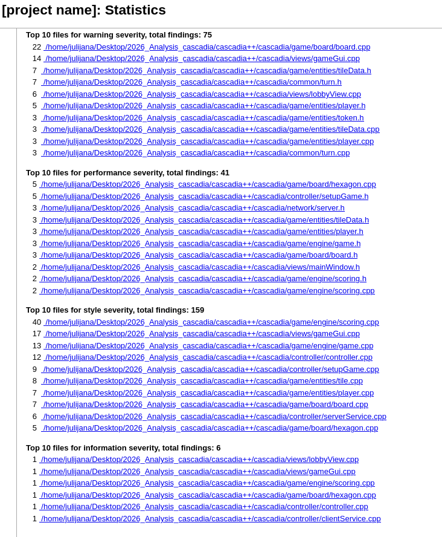
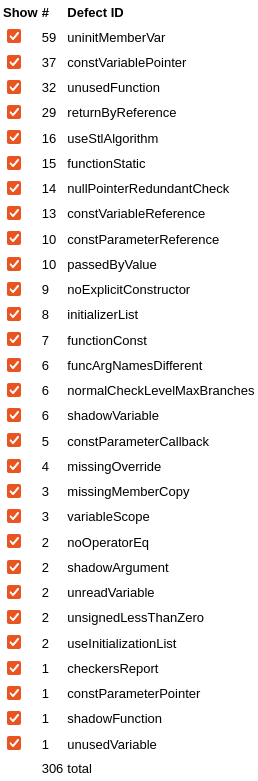

# Cppcheck analiza

Za statičku analizu izvornog koda aplikacije Cascadia korišćen je alat
Cppcheck. Analiza je sprovedena na osnovu
`compile_commands.json` datoteke, a rezultati su sačuvani u XML formatu i
zatim pretvoreni u HTML izveštaj pomoću alata `cppcheck-htmlreport`.

## Preduslovi

Na Ubuntu/Debian sistemu potrebno je dodatno instalirati `cppcheck` alat:

```bash
sudo apt install cppcheck
```

## Pokretanje analize

Pre pokretanja analize potrebno je kopirati konfiguracionu datoteku:

```bash
cp cppcheck.cfg.example cppcheck.cfg
```

Analiza je pokrenuta sledećim opcijama:

```bash
cppcheck \
    -j "$JOBS" \
    --cppcheck-build-dir="$BUILD_DIR/cppcheck_cache" \
    --project="$BUILD_DIR/compile_commands.json" \
    --file-filter="$SOURCE_DIR/*" \
    --enable=all \
    --inconclusive \
    --library=qt \
    --suppress=missingIncludeSystem \
    --language=c++ \
    --std=c++20 \
    --platform=unix64 \
    --xml \
    --xml-version=2 \
    2>"$XML_FILE"
```

Skripta `cppcheck.sh` pre analize automatski konfiguriše projekat i generiše
`compile_commands.json` pomoću CMake-a:

```bash
cmake -S ../cascadia++/cascadia -B ../build_cppcheck \
    -DCMAKE_BUILD_TYPE=Debug \
    -DCMAKE_CXX_STANDARD=20 \
    -DCMAKE_EXPORT_COMPILE_COMMANDS=ON
```

To je JSON datoteka koju CMake generiše kada je uključena
opcija `CMAKE_EXPORT_COMPILE_COMMANDS=ON`.
 Cppcheck koristi te zapise da analizira izvorni kod u istom kontekstu u kojem
se projekat kompajlira. Na taj način pravilno koristi include putanje, makroe,
Qt zaglavlja i opcije kompajlera. 

Opcija `--enable=all` uključuje sve dostupne kategorije provera, izuzev
`unusedFunction`, koja nije dostupna kada se analiza izvršava uz opciju `-j`.
Opcija `--inconclusive` uključuje i nalaze za koje Cppcheck nema potpunu
sigurnost. Opcija `--suppress=missingIncludeSystem` koristi se za potiskivanje
upozorenja koja nastaju zbog nedostupnih sistemskih zaglavlja i mogu predstavljati
lažno pozitivne rezultate.

## Rezultati

Rezultati jednog konkretnog pokretanja dostupni su u direktorijumu
[`reports/`](reports/), u HTML i XML formatu. Sažetak nalaza prikazan je u
tabeli ne računajući `inconcl`:

| Kategorija | Broj nalaza | Udeo u ukupnom broju |
|:--|--:|--:|
| `style` | 159 | 56,6% |
| `warning` | 75 | 26,7% |
| `performance` | 41 | 14,6% |
| `information` | 6 | 2,1% |
| `error` | 0 | 0,0% |
| **Ukupno** | **281** | **100,0%** |



*Slika 1: Raspodela nalaza prema kategorijama.*

Vrste defekata prema učestalosti prikazane su na sledećoj slici:



*Slika 2: Raspodela defekata prema tipu.*

## Analiza rezultata

**U analiziranom pokretanju nije prijavljen nijedan nalaz kategorije `error`. Dostavljena tabela sadrži 78 upozorenja kategorije `warning`, od kojih su tri označena kao `inconclusive`.**


| Vrsta upozorenja | Broj | Jednostavno značenje |
| --- | ---: | --- |
| `uninitMemberVar` | 59 | Konstruktor ne postavlja početnu vrednost nekog polja. |
| `missingMemberCopy` | 3 | Konstruktor kopije izostavlja neko polje; potrebno je proveriti da li je to namerno. Sva tri nalaza su `inconclusive`. |
| `noOperatorEq` | 2 | Klasa upravlja resursima, ali nema sopstveni operator dodele koji uređuje njihovo kopiranje. |
| `nullPointerRedundantCheck` | 14 | Pokazivač se koristi pre provere da li je `nullptr`, pa je provera zakasnela ili suvišna. |
| **Ukupno** | **78** |  |

| Klasa | Neinicijalizovana polja | Izostavljeno kopiranje | Operator dodele | Provera pokazivača | Ukupno |
| --- | ---: | ---: | ---: | ---: | ---: |
| `PlayerData` | 1 | 0 | 0 | 0 | 1 |
| `Turn` | 9 | 1 | 1 | 0 | 11 |
| `ServerService` | 1 | 0 | 0 | 0 | 1 |
| `Board` | 22 | 0 | 0 | 0 | 22 |
| `Player` | 7 | 2 | 1 | 0 | 10 |
| `TileData` | 10 | 0 | 0 | 0 | 10 |
| `Token` | 3 | 0 | 0 | 0 | 3 |
| `GameGui` | 0 | 0 | 0 | 14 | 14 |
| `LobbyView` | 6 | 0 | 0 | 0 | 6 |
| **Ukupno** | **59** | **3** | **2** | **14** | **78** |


### Neinicijalizovana polja — `uninitMemberVar` (59)

Primer je defaultni konstruktor `Player()`. Posebno je interesantan pokazivač `m_hexagonGrid`, koji konstruktor ne postavlja, a destruktor koristi u izrazu `delete m_hexagonGrid`. Zato pravljenje lokalnog objekta tim konstruktorom i njegovo uništavanje bez prethodnog postavljanja pokazivača nije bezbedno.

Ipak, u pozivima u `Controller` koriste se konstruktori sa parametrima, koji prave mrežu. Identifikator izostavljen u konstruktoru sa imenom igrača naknadno postavlja `SetupPlayers`. Nije potvrđeno da se problem podrazumevanog konstruktora ispoljava tokom normalne partije.

Drugačiji primer je konstruktor `Turn` sa parametrima: prima `newTile` i `playerId`, ali ih ne upisuje u odgovarajuća polja. To je konkretan propust u čuvanju prosleđenih podataka.


### Izostavljeno kopiranje polja — `missingMemberCopy` (3)

Kod `Turn` se `ownsData` ne preuzima iz originala, već ostaje `false`. To može biti namerno: kopija pozajmljuje podatke i ne oslobađa ih. Slepo kopiranje vrednosti `true`, uz kopiranje istih pokazivača, omogućilo bi da dva objekta oslobađaju iste podatke. Pozajmljena kopija pritom sme da se koristi samo dok podaci postoje. 

Sva tri nalaza su označena kao `inconclusive`. Potrebno je razjasniti namenu kopije i vlasništvo.

### Nedostajući operator dodele — `noOperatorEq` (2)

`Player` oslobađa svoj grid u destruktoru i ima konstruktor kopije koji pravi novi grid, ali nema sopstveni operator dodele. Zato `Player b(a)` i `b = a` nemaju isto ponašanje: automatska dodela kopira adresu mreže. Prethodni grid odredišta može ostati neoslobođena, a oba objekta mogu pokušati da oslobode istu grid.

### Provera pokazivača posle upotrebe — `nullPointerRedundantCheck` (14)

U `GameGui::setupUi()` pokazivač `m_game` koristi se za pristup tabli, pa se tek zatim proverava kroz `if (... && m_game)`. Takva provera ne štiti prethodnu upotrebu.

Ako klasa zahteva postojeći objekat igre, provera je suvišna. Ako prihvata `nullptr`, provera mora prethoditi prvoj upotrebi, uključujući konstruktor koji odmah poziva metode za crtanje. U kodu `Controller` prvo pravi `Game`, pa ga prosleđuje `GameGui`.

## Performanse

Cppcheck je prijavio **41 upozorenje** kategorije `performance`:

| Vrsta prijave           |   Broj | Značenje                                                                       |
| ----------------------- | -----: | ------------------------------------------------------------------------------ |
| `returnByReference`     |     29 | Predlaže vraćanje podataka kroz konstantnu referencu radi izbegavanja kopija.  |
| `passedByValue`         |     10 | Predlaže prosleđivanje parametara kroz konstantnu referencu.                   |
| `useInitializationList` |      2 | Predlaže direktnu inicijalizaciju polja umesto naknadne dodele u konstruktoru. |
| **Ukupno**              | **41** |                                                                                |

Najvažnije prijave odnose se na kopiranje mapa rezultata u klasama `Player` i `Scoring`, kao i prosleđivanje stringova i kolekcija po vrednosti. 

**Ovo su predlozi optimizacije, a ne potvrđeni problemi brzine izvršavanja.** Stvarni uticaj treba proveriti merenjem.
