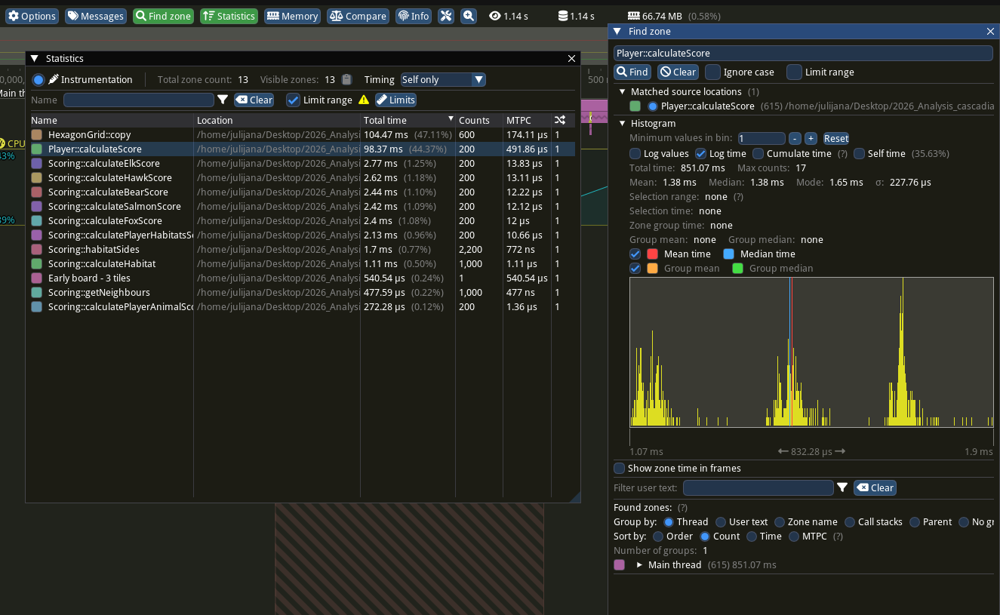
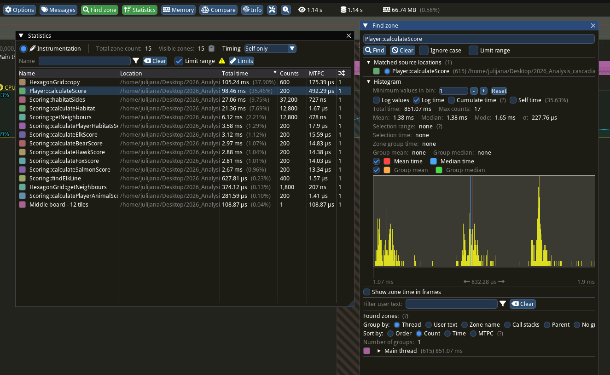
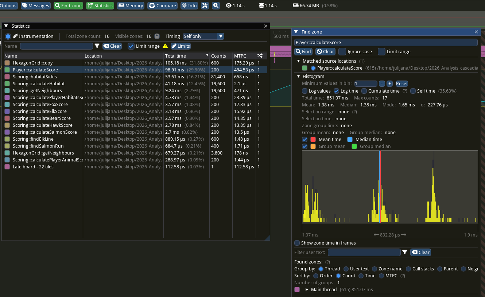

# Profilisanje pomoću alata Tracy

Tracy koristimo da izmerimo koliko traju pojedine operacije u igri Cascadia++.
Na primer, možemo da uporedimo vreme bodovanja životinja, vreme bodovanja staništa
i vreme kopiranja mreže igrača.

U funkcije koje pratimo dodate su **zone**. Zona beleži početak i kraj jednog
izvršavanja funkcije. U Tracy te zone vidimo kao blokove na vremenskoj
liniji, a u statistici kao broj poziva i njihova trajanja.

## 2. Priprema

Za Ubuntu instaliraj potrebne pakete:

```bash
sudo apt update
sudo apt install build-essential cmake git patch pkg-config \
    qt6-base-dev qt6-multimedia-dev libglfw3-dev libfreetype6-dev libdbus-1-dev \
    gstreamer1.0-plugins-base gstreamer1.0-plugins-good libwayland-dev wayland-protocols
```

Tracy se preuzima automatski pri prvom pokretanju. Prvo kompajliranje zato traje
duže i zahteva internet. Skripta koristi dve paralelne kompilacije (`--parallel 2`).
Koristi se **Tracy 0.11.1**.

## 3. Pokretanje scenarija

Skripta redom:

1. Pravi posebnu kopiju izvora u `tracy/build/source` i u nju dodaje Tracy zone.
2. Kompajlira scenario i alat `tracy-capture`, koji prima podatke o izvršavanju.
3. Pokreće snimač, zatim scenario i čeka da se snimanje završi.
4. Čuva snimak i logove u novom direktorijumu unutar `tracy/reports`.

Izvorni fajlovi u podmodulu ostaju neizmenjeni. Za profilisanje se koristi
`RelWithDebInfo`.
Konfiguracija ne uključuje coverage ni sanitizere.


| Zona u snimku | Operacije |
|---|---|
| `Early board - 3 tiles` | 200 obračuna rezultata na tabli sa 3 početne pločice, bez tokena. |
| `Middle board - 12 tiles` | 200 obračuna na tabli sa 12 pločica i 9 tokena. |
| `Late board - 22 tiles` | 200 obračuna na tabli sa 22 pločice i 19 tokena. |
| `Selectable neighbours - 22 tiles` | 200 prolazaka koji označavaju slobodna susedna polja. |
| `JSON loading - 50 repetitions` | 50 učitavanja običnih i početnih pločica, svaki put u nove objekte. |
| `Tile serialization - 200 passes` | 200 prolazaka kroz 85 običnih pločica: pretvaranje u `QVariant` i učitavanje u novi objekat. |

Sve tri table koriste **isti grid 30 × 30**, kakvu pravi klasa `Player`.
Menja se broj postavljenih pločica, a ne dimenzija grida.
Raspored je unapred zadat i povezan. Podaci se uzimaju iz originalnog
`resources/storage.json`: prvi skup početnih pločica i prvih 19 običnih pločica.
Na obične pločice postavlja se po jedna životinja koju ta pločica dozvoljava.
Veće table proširuju manje istim redosledom.

Ovo su ručno formirana stanja za poređenje, a ne snimak nasumično odigrane partije.
Ona omogućavaju da svako pokretanje koristi iste podatke. Učitavanje JSON-a meri
obradu ugrađenog Qt resursa, pa iz njega ne izvodimo zaključke o brzini diska.

Pre svake grupe od 200 obračuna izvršava se još 5 obračuna za zagrevanje.
Priprema tabli i zagrevanje imaju zasebne zone i **ne uključuju se u poređenje**.
U log se ispisuje kontrolni zbir obrađenih rezultata. On pomaže da proverimo da su
dva pokretanja obradila iste podatke; nije dokaz ispravnosti bodovanja ili serijalizacije.

## 4. Snimanje same igre

```bash
bash tracy/tracy.sh game
```

Otvoriće se instrumentirana igra. Za jedan pregledan snimak:

1. Pokreni igru za jednog igrača.
2. Postavi nekoliko pločica i tokena, uz bar jednu rotaciju pločice.
3. Otvori prikaz rezultata da se izvrši bodovanje.
4. Zatvori igru i sačekaj poruku skripte da je snimak sačuvan.

Ručno igranje može da pokaže kada se
javlja sporija operacija, dok je automatski scenario pogodniji za ponavljanje
istog opterećenja. Automatski scenario ne simulira sve korisničke akcije igre.

**Ovo neće biti deo analize, ostavljeno je samo kao mogućnost.**

## 5. Rezultati

| Fajl | Sadržaj |
|---|---|
| `capture.tracy` | Snimak koji se otvara u Tracy pregledniku. |
| `program.log` | Poruke scenarija ili igre; kod scenarija i kontrolni zbir. |
| `capture.log` | Poruke snimača i eventualni problemi pri povezivanju. |

Svako pokretanje pravi novi direktorijum. 

## 6. Otvaranje snimka u Tracyju

Posle prvog uspešnog pokretanja jednom kompajliraj preglednik iz već preuzete
Tracy verzije:

```bash
cmake -S tracy/build/_deps/tracy-src/profiler -B tracy/build/viewer \
    -DCMAKE_BUILD_TYPE=Release -DLEGACY=ON -DNO_PARALLEL_STL=ON
cmake --build tracy/build/viewer --parallel 2
```

`LEGACY=ON` bira X11 prikaz, a `NO_PARALLEL_STL=ON` uklanja potrebu za dodatnom
TBB bibliotekom. Ove opcije se odnose na Tracy alate.

Zatim pokreni pregledač i kroz **Open** izabrati `capture.tracy`:

```bash
./tracy/build/viewer/tracy-profiler
```

## 7. Merenje i tumačenje

Patch ukupno dodaje 37 zona u 10 izvornih fajlova. Neke, poput funkcija klase
`Game`, pojavljuju se tek kada pokreneš igru i izvršiš odgovarajuće akcije.

- **Broj poziva** govori koliko puta je funkcija izvršena u izabranom intervalu.
- **Ukupno vreme (total)** je zbir trajanja njenih poziva.
- **Prosečno vreme** je ukupno vreme podeljeno brojem poziva.
- **Maksimalno vreme** pokazuje najduži zabeleženi poziv.
- **Self time** izuzima vreme u ugnježdenim instrumentiranim zonama.

Vremena roditeljske i unutrašnjih zona se preklapaju. Zato ih ne sabiramo kao
nezavisne troškove.
Tracy zone mere proteklo vreme, koje može da obuhvati i čekanje ili prekid rada
niti. Najduži poziv zato nije sam po sebi dokaz sporog algoritma.








Prikazujemo vreme zone bez vremena ugnježdenih Tracy zona (self only). Zato približno 492 µs kod Player::calculateScore nije ukupno trajanje jednog obračuna.

Sa slika dobijamo sledeća ukupna self vremena za po 200 obračuna:

Zona	 | 3 pločice	| 12 pločica	| 22 pločice
|---|---|---|---|
HexagonGrid::copy	|  104,47 ms	| 	105,24 ms		| 105,18 ms
Player::calculateScore | 	98,37 ms		| 98,46 ms		| 98,91 ms
Scoring::habitatSides	| 1,70 ms	| 	27,06 ms		| 53,61 ms
Scoring::calculateHabitat	| 	1,11 ms	| 	21,36 ms		| 41,18 ms

Kopiranje predstavlja veliki, gotovo stalan trošak. U svakom scenariju imamo 600 kopiranja za 200 obračuna, odnosno tri kopiranja po obračunu.
Ona nastaju:
- pri inicijalizaciji člana Scoring::m_player;
- pri prosleđivanju igrača po vrednosti u calculatePlayerAnimalScore;
- pri prosleđivanju igrača po vrednosti u calculatePlayerHabitatsScore.

Kopiranje igrača pokreće duboko kopiranje celog grida. U sva tri scenarija grid ima 30 × 30 polja, pa se kopira svih 900 polja bez obzira na broj postavljenih pločica. To objašnjava približno jednako vreme kopiranja. 

Obrada staništa postaje znatno skuplja, trošak raste prvenstveno zato što se funkcija poziva mnogo više puta.
U kodu se obilazak staništa pokreće ponovo za svaku postavljenu pločicu, sa novom evidencijom posećenih polja. To omogućava ponovljeni obilazak iste povezane grupe i objašnjava zabeleženi rast.


**Sada upoređujemo i potvrđujemo naša oučavanja: prosečno trajanje raste sa 1,11 ms na 1,65 ms, odnosno približno 49,5% između početne i završne table.**

Uključeno je **With children**, pa vreme `Player::calculateScore` obuhvata i operacije koje se izvršavaju unutar njega.

| Scenario   | Broj obračuna | Ukupno vreme bodovanja | Prosečno po obračunu |
| ---------- | ------------: | ---------------------: | -------------------: |
| 3 pločice  |           200 |              221,19 ms |              1,11 ms |
| 12 pločica |           200 |              277,54 ms |              1,39 ms |
| 22 pločice |           200 |              330,63 ms |              1,65 ms |

**Kopiranje mreže ima veliki, gotovo stalan trošak.**

`HexagonGrid::copy` traje ukupno **104,47–105,24 ms** u svakom scenariju. Zabeleženo je po **600 poziva**, odnosno tri kopiranja po obračunu.
To odgovara približno **0,52 ms kopiranja po obračunu**. 

Potencijalna optimizacija je smanjenje nepotrebnih kopiranja igrača i mreže, uz proveru gde je bezbedno koristiti reference.

**Najveći deo povećanja vremena dolazi iz obračuna staništa.**

Za `Scoring::calculatePlayerHabitatsScore`, uključujući njegove unutrašnje pozive, imamo:

| Scenario   | Ukupno vreme obračuna staništa |
| ---------- | -----------------------------: |
| 3 pločice  |                        5,42 ms |
| 12 pločica |                       58,13 ms |
| 22 pločice |                      108,81 ms |

Između prve i poslednje table ukupno bodovanje raste za **109,44 ms**, a obrada staništa za **103,39 ms**. Dakle, ona objašnjava najveći deo zabeleženog povećanja.

Ovo je u skladu sa prethodnim nalazom iz koda: obilazak staništa pokreće se iznova za svaku postavljenu pločicu, pa se iste povezane grupe mogu obilaziti više puta.
